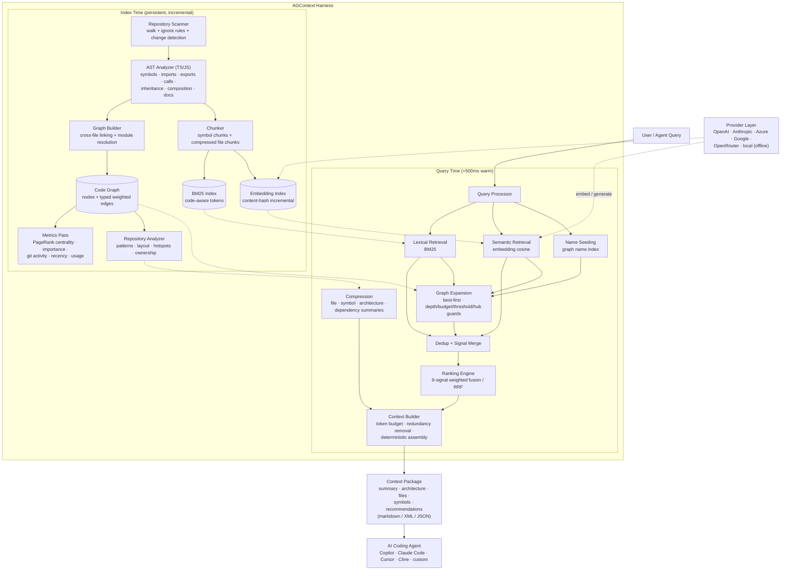

# AGContext — High-Level Architecture

AGContext is a pipeline with a persistent brain. Index time builds and stores
everything expensive (AST analyses, the code graph, chunks, embeddings,
corpus metrics, the repository report); query time is a fast, deterministic
walk through in-memory structures.

## System Diagram



The brief's canonical flow maps onto this directly:

```text
User Query → AGContext → Code Graph → Hybrid Retrieval →
Repomix-style Compression → Ranking Engine → Context Builder → Agent
```

(In the implementation, ranking runs on retrieval candidates _before_
compression decides representations — compression is how the builder fits
ranked content into the budget. Both orderings describe the same dataflow:
the ranked graph neighborhood, compressed, assembled.)

## Layer Responsibilities

| Layer                   | Module(s)                  | Responsibility                                                                                                                                                                                                  |
| ----------------------- | -------------------------- | --------------------------------------------------------------------------------------------------------------------------------------------------------------------------------------------------------------- |
| **Core**                | `src/core/`                | Domain types (nodes, edges, chunks, candidates, context package), typed errors, ports (Logger, TokenCounter, Clock), pure utilities (tokenization, hashing, heap, normalization math). Zero IO.                 |
| **Config**              | `src/config/`              | Zod-validated user config, `agcontext.config.ts` discovery/loading (jiti), layered resolution: defaults ← file ← constructor options.                                                                           |
| **Scanner**             | `src/indexing/scanner.ts`  | Deterministic repository walk honoring built-in ignores, `.gitignore`, configured excludes, extension and size filters.                                                                                         |
| **AST Analyzer**        | `src/indexing/analyzer.ts` | Per-file, parse-only TypeScript compiler API extraction: symbols with signatures/docs/line ranges, import bindings, export surface, call sites, heritage, composition, type references. Pluggable per language. |
| **Graph Builder**       | `src/graph/builder.ts`     | Cross-file linking: NodeNext-aware module resolution, re-export chain resolution, name resolution (import binding → same-file → unique global), producing the typed, weighted multigraph.                       |
| **Code Graph**          | `src/graph/graph.ts`       | The graph store: adjacency both directions, name index, merge-on-duplicate edges, deterministic JSON serialization.                                                                                             |
| **Metrics**             | `src/graph/metrics.ts`     | Corpus signals precomputed at index time: weighted PageRank centrality, composite file importance, dependency weight, git activity, recency, symbol usage — all normalized to [0,1].                            |
| **Expansion**           | `src/graph/traversal.ts`   | Best-first traversal from seeds under four anti-explosion guards (depth, budget, score threshold, hub damping).                                                                                                 |
| **Chunker**             | `src/indexing/chunker.ts`  | Retrieval units: verbatim symbol slices + compressed file views; chunk id = graph node id.                                                                                                                      |
| **Retrieval**           | `src/retrieval/`           | BM25 index, embedding index (contiguous Float32 matrix), query parsing, and the hybrid orchestrator (generate → expand → dedup → signal merge).                                                                 |
| **Ranking**             | `src/ranking/ranker.ts`    | Signal normalization strategy + weighted / RRF fusion with per-query weight renormalization; fully deterministic ordering.                                                                                      |
| **Compression**         | `src/compression/`         | File summaries (signatures, no bodies), symbol cards, architecture bullets, dependency maps.                                                                                                                    |
| **Context Builder**     | `src/context/`             | Token-budgeted assembly: representation ladder (full → compressed → mention), redundancy elimination, graph-driven recommendations, markdown/XML/JSON renderers.                                                |
| **Providers**           | `src/providers/`           | `LLMProvider` port + adapters (OpenAI, Anthropic, Azure, Google, OpenRouter, local), env-based registry with auto-selection and plugin registration.                                                            |
| **Indexer**             | `src/indexing/indexer.ts`  | Orchestrates index runs: layered change detection, cache persistence, incremental embeddings, repository analysis; loads snapshots for query time.                                                              |
| **Repository Analyzer** | `src/analysis/`            | Repository intelligence: identity, languages, frameworks, patterns, layout roles, top-imported/central files, external deps, hotspots, ownership.                                                               |
| **Cache**               | `src/cache/`               | `.agcontext/` workspace layout; versioned, atomic, self-healing JSON stores.                                                                                                                                    |
| **Telemetry**           | `src/telemetry/`           | Opt-in, local-only metrics: ring buffer + JSONL sink; latency/token accounting.                                                                                                                                 |
| **Plugins**             | `src/plugins/`             | Contracts + manager for Graph/Ranking/Compression/Provider plugins and lifecycle hooks.                                                                                                                         |
| **Facade**              | `src/agcontext.ts`         | `AGContext` — the composition root wiring everything with dependency injection; public API.                                                                                                                     |
| **CLI**                 | `src/cli/`                 | `agc` commander program: thin, testable handlers over the facade.                                                                                                                                               |

## Dependency Direction (Clean Architecture)

```text
core  ←  config ← cache ← telemetry ← providers
  ↑         ↑
indexing ← graph ← analysis ← retrieval ← ranking ← compression ← context
  ↑                                                        ↑
plugins  ←──────────────  agcontext (facade)  ─────────────┘
                               ↑
                              cli
```

- `core` depends on nothing; every arrow points inward toward it.
- IO adapters (fs caches, git subprocess, HTTP providers) live at the edges
  behind interfaces; the pipeline is testable with fakes at every seam.
- The facade is the only composition root; nothing below it constructs
  cross-module dependencies.

## Persistence Layout

```text
.agcontext/
  index-meta.json     # stats, timestamps, config fingerprint
  analyses.json       # per-file AST analyses keyed by content hash
  graph.json          # serialized code graph (deterministic ordering)
  chunks.json         # retrieval chunks per file (hash-keyed)
  embeddings.json     # base64 Float32 vectors + per-chunk content hashes
  repository.json     # repository intelligence report
  telemetry/          # opt-in JSONL events
```

Every store carries a schema version; a mismatch (or corruption) reads as a
cold cache and rebuilds — the cache is self-healing by construction.

## Incrementality Model

1. Files unchanged by `(size, mtime)` skip hashing entirely.
2. Files unchanged by content hash reuse cached analyses and chunks —
   parsing is the expensive step and is skipped.
3. The graph is **fully relinked** every run from (mostly cached) analyses:
   cross-file edges can change when any file changes, and linking costs
   milliseconds where parsing costs seconds.
4. Embeddings recompute only for chunks whose content hash changed; removed
   chunks are pruned from the matrix.
5. A config fingerprint (extensions, excludes, size cap, analyzer version)
   invalidates everything when the indexing contract itself changes.
